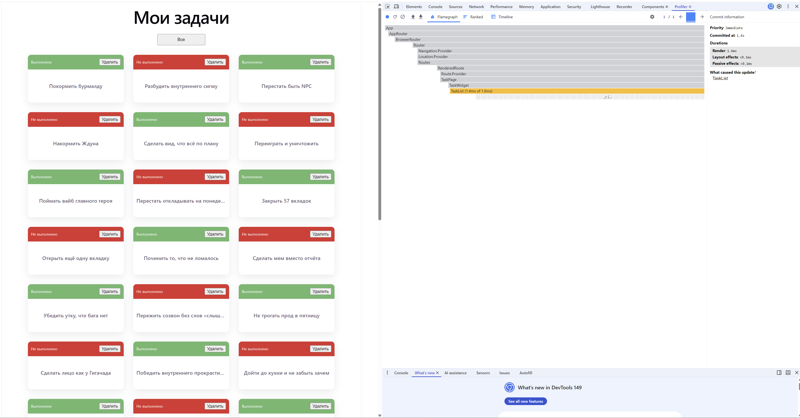
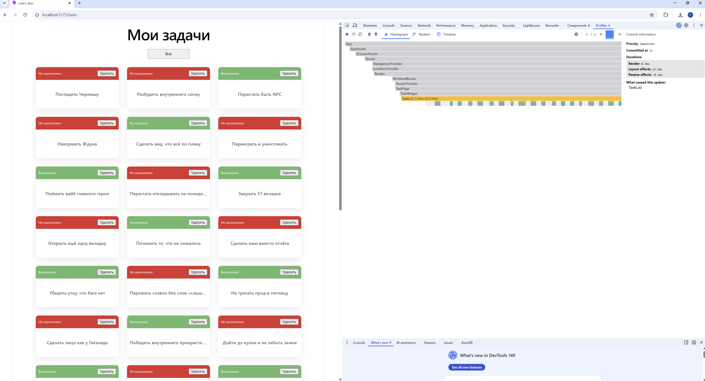
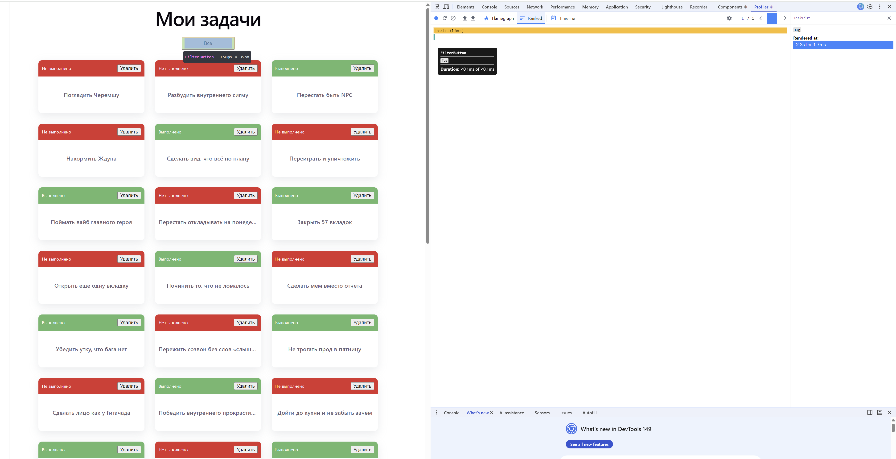

# Анализ производительности

## Компонент TaskCard

В результате оптимизации компонент TaskCard не перерендеривается при перерендере родительского компонента (при условии неизменности пропсов).
Это можно наблюдать при удалении:

На скриншоте видно, что карточки не перерендериваются после удаления одной из них.

Также оптимизировалось поведение при фильтрации:

Нас скриншоте видно, что карточки, которые были на экране до применения фильтрации не перерендериваются. Рендерятся только те карточки, которых не было на экране до применения фильтра.

## Компонент FilterButton

На скриншоте видно, что в результате удаления одной из карточек происходит перерендер компонента FilterButton, несмотря на то, что его видимое состояние не менялось:

Компонент FilterButton может быть оптимизирован аналогичным образом: путем оборачивания в React.memo и применения useCallBack к колбекам в пропсах.
